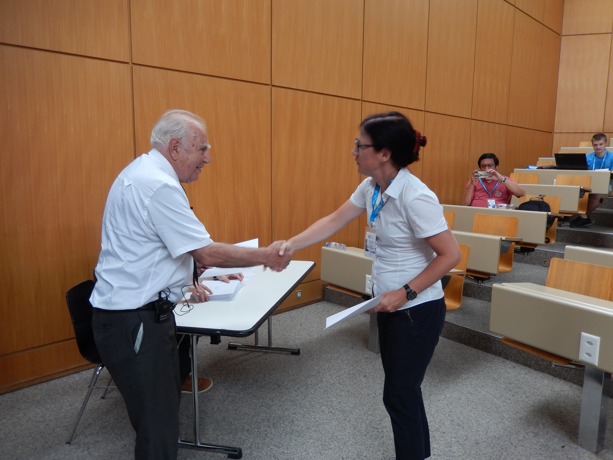

### Hi, I'm Joanna 👋

I'm a **mathematician** turned **actuary** turned **software & data engineer**.

Curious about my different “incarnations”? Take a peek, have a click:
- [Data Engineer](#data-engineer) 
- [Software Developer](#software-developer)
- [Actuary](#actuary)
- [Mathematician](#mathematician)

---

## Data Engineer

As a Data Engineer, I delivered Big Data solutions to an enterprise client. Key responsibilities:
- designing, implementing, and optimizing data processing pipelines using PySpark and Databricks 
- migrating complex ETL processes from AWS Redshift and Pentaho to PySpark workflows on Databricks, improving performance and maintainability
- implementing SCD2 (Slowly Changing Dimensions Type 2) patterns to track historical data changes and support accurate analytical reporting
- contributing to version-controlled, testable Python codebases using Git, GitHub, GitHub Actions and CI/CD practices, with extensive use of Pytest and with strong focus on code quality
- conducting detailed data validation and comparison (using e.g. DataComPy lib) between legacy and migrated pipelines to ensure consistency, accuracy, and business continuity
- ensuring high standards of data quality, system performance, and scalability

For more details, see my <a href="https://pl.linkedin.com/in/joanna-jaroszewska">linkedin</a>.

---

## Software Developer

I worked as a Java Developer for almost 3 years. I was using **Spring** and **SAP Commerce Cloud (Hybris)** frameworks. 
I particularly liked working with data using **Hibernate** and other ORMs, 
as well as various databases (**MS SQL, Oracle, PostgreSQL, MySQL**). 
What regards frontend, I worked with <b>Angular</b> and <b>React</b>, Thymeleaf, JSP, and other template engines (e.g. one was driven by <b>Clojure</b>).

For more details, see my <a href="https://pl.linkedin.com/in/joanna-jaroszewska">linkedin</a>.

---

## Actuary

From October 2013 to February 2019, I worked as an **actuary** (i.e. essentially an insurance *data scientist*), 
combining statistical modelling, domain expertise, and programming.

Main areas of responsibility: 
- design and implementation of **PL/SQL code** for actuarial reserve calculations 
including documentation and UAT (User Acceptance Testing) to validate provided solutions
- **modeling of new life insurance products**, including model design and documentation,
reserve calculations, collaboration with IT on implementation into core systems
- health insurance **pricing** and building tariffs for new health insurance products
- calculation of technical provisions: 
  - Best Estimate reserve calculation at quarters' closings by a chain ladder method (Solvency II), 
  - Solvency Capital Requirement calculation under Standard Formula, 
  - Unexpired Risk Reserve and Bonuses Reserve calculation at months' closings (PAS)
- **reinsurance**: reserve calculations, settlements, preparation of renewal data and liaison with reinsurers
- **coordination** of the preparation of the annual actuarial report on insurance portfolio, including development of 
the reinsurance section

For more details, see my <a href="https://pl.linkedin.com/in/joanna-jaroszewska">linkedin</a>.

### Actuarial Training

To further strengthen my actuarial expertise, I participated in a number of international trainings and professional 
courses related to actuarial sciences and my Certified Auditor Candidate (Kandydat na Biegłego Rewidenta) status, 
including:
<ul>
<li>
11-12.III.2019
&nbsp;
Advanced Non-Life Pricing & Profitability: Machine Learning Techniques with R, Athens
</li>
<li>
26-29.IX.2018
&nbsp;
Actuarial Modelling with special consideration of Solvency II - course for Austrian Actuaries,
organized by Austrian Financial Market Authority (FMA) and Salzburg University,
Salzburg
</li>
<li>
13-17.VIII.2018
&nbsp;
Insurance Analytics, a Primer - 31st International Summer School of The Swiss Association of Actuaries,
Lausanne, Switzerland
 
Below you may find me and professor Hans Bühlmann (yes, THIS Bühlmann that you may know from 
<a href="https://en.wikipedia.org/wiki/B%C3%BChlmann_model">
Bühlmann model</a>) at the closing ceremony of the School.
 

  

</li>

<li>
8.IV-24.VIII.2018
&nbsp;
Accounting Theory and Principles - Training for Certified Auditor Candidates
</li>
<li>
4–7.IV.2018
&nbsp;
International Accounting of Insurance Companies - course for Austrian Actuaries,
organized by FMA and Salzburg University,
Salzburg
</li>
<li>
19–20.III.2018
&nbsp;
Non-Life Pricing: Introduction to practical implementation of modern techniques in R 
 - Training organized by European Actuarial Academy,
Athens
</li>
<li>
1.XII.2017
&nbsp; 
Professionalism - training organized by Polish Actuarial Society,
Warsaw
</li>
<li>
18–19.X.2017
&nbsp;
Understanding IFRS 17 - Training organized by European Actuarial Academy,
Lisbon
</li>
<li>
15.IX.2017
&nbsp;
IFRS 17 
(in a frame of 28. Warsaw Actuarial Summer School),
Warsaw
</li>
<li>
11–12.IX.2017
&nbsp;
Reinsurance and modelling natural disasters, 
with Excel exercises on reinsurance pricing
(in a frame of 28. Warsaw Actuarial Summer School),
Warsaw
</li>
<li>
7.IX.2017
&nbsp;
Economics and internal control - Passing the exam for Certified Auditor Candidates,
Warsaw
</li>
<li>
19.V–26.VI.2017
&nbsp;
Economics and internal control - Training for Certified Auditor Candidates,
Warsaw
</li>
<li>
19–22.IV.2017
&nbsp;
Risk Management In Insurance - course for Austrian Actuaries,
organized by FMA and Salzburg University,
Salzburg
</li>
<li>
II.2017–VI.2017
&nbsp;
Macroeconomics - remote training organized by The Polish Society of Actuaries,
completed with passing the exam, 
in Polish,
Warsaw
</li>
<li> 
12–13.IX.2016
&nbsp;
Internal models for life insurance companies in Europe - market approach and solutions
(in a frame of 27. Warsaw Actuarial Summer School),
in Polish,
Warsaw
</li>
<li>
8–9.IX.2016
&nbsp;
Claim Cost Estimation in General Insurance,
(in a frame of 27. Warsaw Actuarial Summer School),
Warsaw
</li>
<li>
<b style="color:red;">
X.2015–VI.2016
&nbsp;
Selected Actuarial Methods - approx. 112 hours long course organized by The Polish Society of Actuaries,
with exercises in R,
completed with passing the exam, 
in Polish,
Warsaw
</b>
</li>
<li>
13–14.XI.2015
&nbsp;
Solvency II Standard Formula Calibration Processes and Results 
(in a frame of 12th HAS Fall School of the Hungarian Actuarial Society), 
Visegrad, Hungary
</li>
<li>
23–24.IX.2015
&nbsp;
Reinsurance Mathematics 
(in a frame of 26. Warsaw Actuarial Summer School),
Warsaw
</li>
<li>
17–18.IX.2015
&nbsp; 
Accounting and reporting of insurance companies
(in a frame of 26. Warsaw Actuarial Summer School), completed with passing the exam, 
in Polish,
Warsaw
</li>
<li>
14–16.IX.2015 
&nbsp; 
Models and Statistics for Loss Distributions 
(in a frame of 26. Warsaw Actuarial Summer School), with exercises in R,
Warsaw
</li>
</ul>

---

## Mathematician

I earned my PhD at the Jagiellonian University in the field of stochastic dynamics and applied mathematics. 
My dissertation, 
*On Stability of Markov Operators and Its Applications in Biomathematics and in the Theory of Iterated Function Systems*, 
was awarded *summa cum laude*.

Following my doctoral studies, I held academic positions at 
the Faculty of Mathematics, Informatics and Mechanics at the University of Warsaw, 
as well as at the Faculty of Mathematics and Natural Sciences at Cardinal Stefan Wyszyński University. 
During this time, I conducted scientific research, prepared conference presentations, and authored academic publications.

In parallel with my research work, I developed strong analytical, communication, and mentoring skills.
I delivered a wide range of lectures/classes, including:
- time series analysis **with R**
- stochastic differential equations
- stochastic processes
- statistics 
- probability
- differential equations and dynamical systems **with Mathematica**
- dynamical systems
- mathematical analysis
